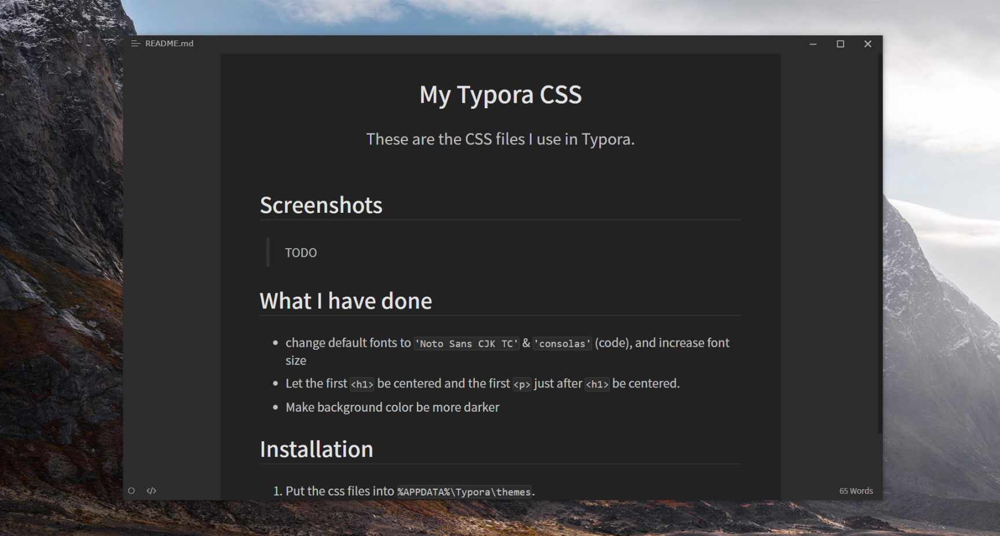

# My Typora CSS

These are the CSS files I use in Typora.

## Screenshots

### light version

### dark version

## What I have done

The light version is modified from [typora/typora-default-themes](https://github.com/typora/typora-default-themes) .

The dark version is modified from [typora/typora-ash-theme](https://github.com/typora/typora-ash-theme) .

What I have modified to the 2 css files are as follows :

- change default fonts to `'Noto Sans CJK TC'` & `'consolas'` (code), and increase font size
- Let the first `<h1>` be centered and the first `
` just after `<h1>` be centered.

Besides, the dark version has been modified more :

- Make background color be darker.

## Installation

1. Put the css files into `%APPDATA%\Typora\themes ` .
2. Choose the theme in Typora.
3. That's it !

## TODOs

- [ ] Make the dark version printable.